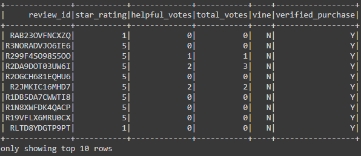
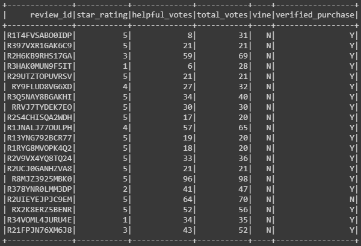
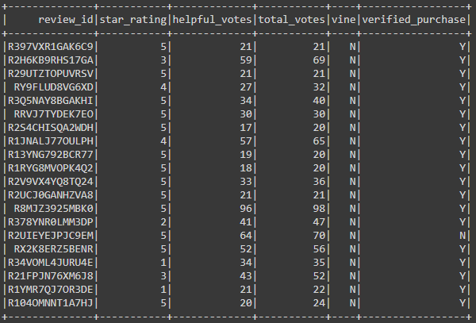
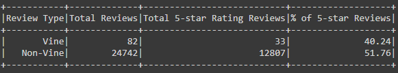

# Amazon_Vine_Analysis

   

extract, transform, connect to an AWS RDS instance and load the transformed data into the database for analysis to determine any bias on reviews from vine members. 

## Purpose

This project was initiated to determine Automotive reviews for Amazon Vine and if there is a bias or difference in a paid or unpaid 5 star review.
To get or measure this bias an analysis determining the percentage of paid vs unpaid, vine vs non vine 5 star ratings were extracted from the Automotive reviews dataset.

## Resources

- Google Colab Notebooks
- VS Code v1.52.0
- PostgresSQL v12
- PgAdmin v4.24
- Amazon Cloud (AWS) - RDS and S3
- [Automotive Review Data](https://s3.amazonaws.com/amazon-reviews-pds/tsv/amazon_reviews_us_Automotive_v1_00.tsv.gz)

## Results

  - The Dataset/ Data frame (vine_df) was initially filtered to get the required information columns transformed to show:

    

  - Reviews that had at least 20 votes

    

  - A percentage of helpful votes greater than 50%

    

  - Total of Vine reviews - 82
  - Total of non Vine reviews - 24742
  - Total 5-Star paid reviews - 33
  - Total 5-star unpaid reviews - 12807
  - % 5-Star paid vs unpaid (respectively) - 40.24% vs 51.76%

    

## Summary

- There is a 12% difference noticed when comparing vine reviewers with non vine reviewers (5-Star ratings), There is certainly no bias noticed.

### Additional Analysis

- To look into verified purchases confirming that the reviewer received or even purchased the product or not.
- Analysis using 4 star ratings will also be helpful (larger dataset) to notice bias or even mean of star ratings.
